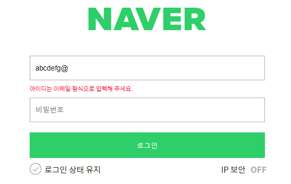
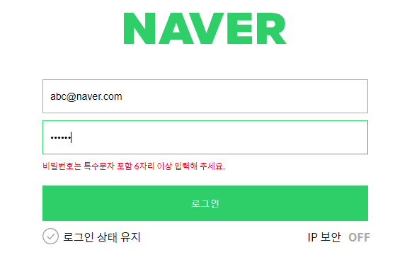
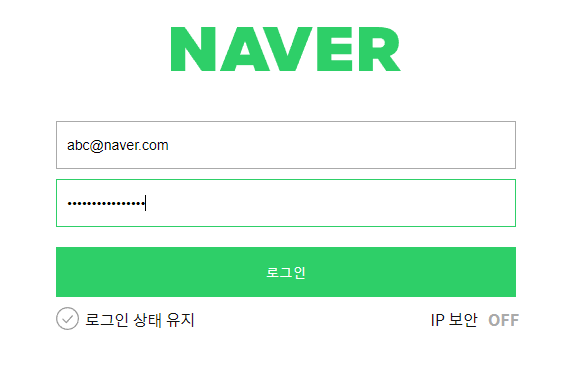
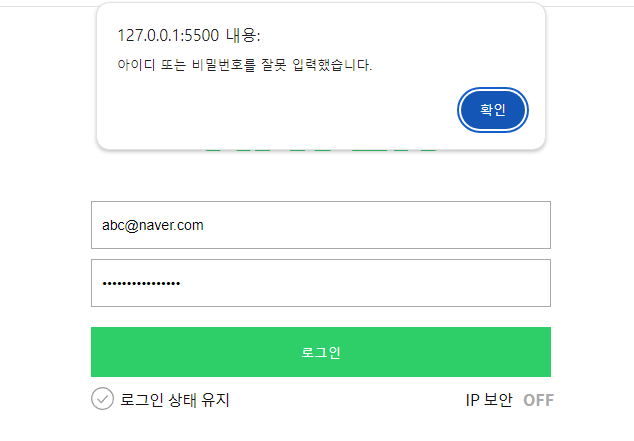

## 네이버 로그인 페이지 구현

### 🎯 목표

---

일치하는 아이디와 비밀번호를 입력했을 경우 welcome 페이지로 이동한다.

### 📌 주요 기능

---

- <b>email 정규표현식을 사용한 validation</b>

  - 입력받은 ID가 조건에 맞는 형식인지 확인
  - 일치하면 Pass, 불일치하면 에러 메세지 출력
     

- <b>pw 정규표현식을 사용한 validation</b>

  - 입력받은 PW가 조건에 맞는 형식인지 확인
  - 일치하면 Pass, 불일치하면 에러 메세지 출력
     

- <b>상태 변수 관리</b>

  -  

- <b>로그인 버튼을 클릭시 조건처리</b>
  - 입력받은 정보와 유저 정보 비교
  - 일치하면 welcome 페이지로 이동
  - 불일치하면 로그인 실패 메세지 출력

### 🛠️ 개선 사항

---

1. 상태 변수 관리
