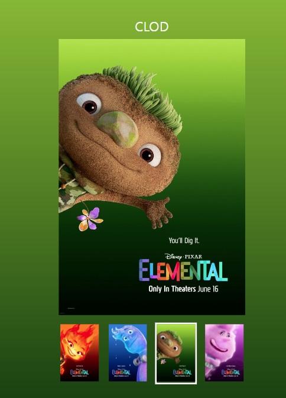
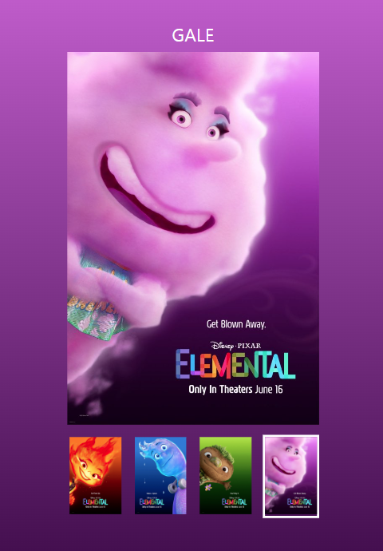

## movie poster 슬라이드 구현

### 🎯 목표

---

썸네일 이미지를 클릭하면 메인 이미지와 배경이 바뀐다.

### 📌 주요 기능

<table>
<tr>
      <td>
      
      </td>
      <td>
     
      </td>
</tr>
<tr>
 <td>
      
      </td>
      <td>
      
      </td>
</tr>
</table>

- <b>클릭 이벤트 활성화</b>

```JavaScript
const navigation = document.querySelector("nav");
```

```JavaScript
navigation.addEventListener("click", handleClick);
```

```JavaScript
  Array.from(li.parentElement.children).forEach((item) =>
    item.classList.remove("is-active")
  );
  li.classList.add("is-active");
```

  <br>

- <b>nav 클릭시 배경 색상 변경</b>

```JavaScript
  let index = li.dataset.index;

  document.body.style.background = `linear-gradient(to bottom, ${
    data[index - 1].color[0]
  },${data[index - 1].color[1]})`;
```

<br>

- <b>이미지 변경</b>

```JavaScript
  mainImage.src = `./assets/${data[index - 1].name.toLowerCase()}.jpeg`;
```

<br>

- <b>텍스트 변경</b>

```JavaScript
  nickName.innerHTML = `${data[index - 1].name}`;
  mainImage.alt = `${data[index - 1].alt}`;
```

### 🛠️ 개선 사항

---

1. 오디오 재생 구현
2. 코드 리팩토링
